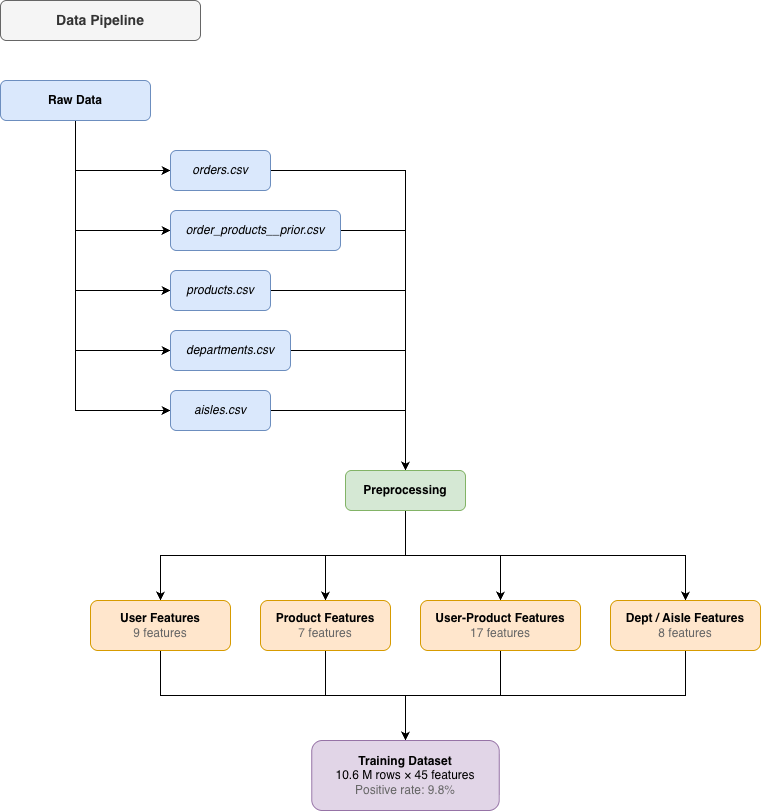
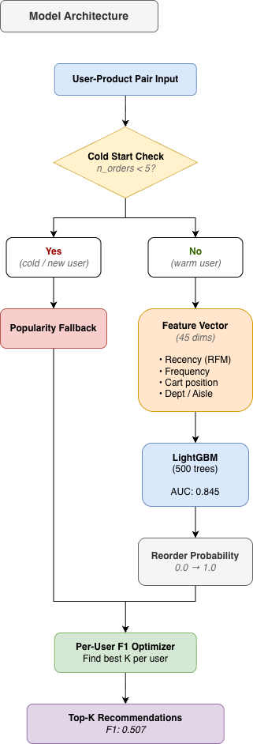
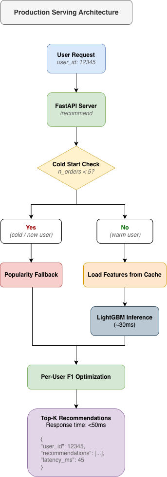

# 🛒 Instacart Recommendation System

> An end-to-end machine learning system predicting grocery reorder behavior,
> built on 13M+ user-product interactions with production-ready serving architecture.

[](https://python.org)
[](https://lightgbm.readthedocs.io)
[](https://fastapi.tiangolo.com)

---

## 📊 Results

| Metric | Baseline (Popularity) | Our Model |
|--------|----------------------|-----------|
| F1 Score | 0.13 | **0.507** |
| AUC | - | **0.845** |
| Precision | - | 0.38 |
| Recall | - | 0.53 |

> **+290% F1 improvement** over popularity baseline

---

## 🎯 Problem Statement

Given a user's complete purchase history, predict which previously purchased
products will appear in their next order.

**Why this matters:**
- Reduces user friction (pre-filled cart)
- Increases order value (relevant suggestions)
- Top 20% products = 91% of sales (long tail problem)

**Dataset scale:**
- 206,209 users
- 49,677 products
- 32M+ prior order interactions
- 13M user-product pairs modeled

---

## 🏗️ Architecture

### Data Pipeline


### Model Architecture  


### Production Serving


---

## 🔬 Feature Engineering

Created **45 features** across 4 categories:

### User-Product Interaction (17 features)
Most predictive features capturing **recency, frequency, and consistency**:

| Feature | Description | Importance |
|---------|-------------|------------|
| `up_orders_since_last` | Orders elapsed since last purchase | ⭐⭐⭐⭐⭐ |
| `up_times_bought` | Total purchases of this item | ⭐⭐⭐⭐⭐ |
| `up_order_streak` | Consecutive orders containing item | ⭐⭐⭐⭐ |
| `up_recency_score` | 1 / (orders_since_last + 1) | ⭐⭐⭐⭐ |
| `up_rfm_score` | Recency × Frequency combined | ⭐⭐⭐ |

### User Features (9 features)
Shopping behavior patterns: order frequency, basket size, reorder ratio

### Product Features (7 features)  
Item characteristics: popularity, reorder rate, cart position

### Department/Aisle Features (12 features)
Category-level signals: department reorder rates, user category preferences

---

## 🧠 Model

**Algorithm**: LightGBM (Gradient Boosted Trees)

**Why LightGBM over alternatives:**
- Handles sparse features efficiently (13M rows)
- Built-in feature importance for interpretability
- Faster training than XGBoost on tabular data
- No deep learning complexity needed for this problem

**F1 Optimization** (key innovation):
Instead of a global threshold, we optimize per-user:
```python
# For each user, find K that maximizes their F1
for K in range(1, n_candidates):
    f1 = calculate_f1(top_K_predictions, true_labels)
best_K = argmax(f1)
```
Result: F1 improved from **0.438 → 0.507** (+15.7%)

---

## ❄️ Cold Start Handling

21.1% of users have fewer than 5 orders, requiring special handling:
```
User Type    Orders    Strategy
─────────────────────────────────────────
New User     0         Popularity-based fallback
Cold User    1-4       Blend(α): model×α + popularity×(1-α)  
Warm User    5+        Pure LightGBM prediction
```

**Alpha blending logic:**
- 1 order → α=0.3 (trust popularity more)
- 3 orders → α=0.5 (equal blend)  
- 5+ orders → α=0.7 (trust model more)

---

## 🚀 Quick Start
```bash
# Clone and setup
git clone https://github.com/BessiePengjinWang/instacart-recommendation-system
cd instacart-recommendation-system
python -m venv venv && source venv/bin/activate
pip install -r requirements.txt

# Download data (requires Kaggle API)
kaggle competitions download -c instacart-market-basket-analysis
unzip instacart-market-basket-analysis.zip -d data/raw/

# Run pipeline
python src/data/preprocessing.py
python src/features/feature_engineering.py
python src/data/dataset_builder.py

# Train model
jupyter notebook notebooks/05_baseline_models.ipynb

# Start API
uvicorn src.api.main:app --reload
```

---

## 🚀 Deployment

### System Requirements

**Docker Deployment:**
- Memory: 12GB+ recommended (due to large feature tables)
- CPU: 4+ cores
- Disk: 2GB

**Why 12GB?** The app loads:
- 206K user features
- 50K product features  
- 13M user-product interaction features (parquet)
- LightGBM model with 500 trees

**Production Optimization:**
In a real production system, we'd use:
- PostgreSQL/Redis for feature storage (query on-demand)
- Feature store (Feast/Tecton) for real-time serving
- Model serving framework (TensorFlow Serving / BentoML)
- This would reduce memory to ~2GB

### Local Development
```bash
# Recommended: run directly (no Docker overhead)
uvicorn src.api.main:app --reload --port 8000
# Memory usage: ~3-4GB
```

### Docker Deployment

**Step 1: Configure Docker Resources**
- Docker Desktop → Settings → Resources
- Memory: 12GB minimum
- Swap: 2GB

**Step 2: Build and Run**
```bash
# Build image
docker build -t instacart-recommender:v1 .

# Run with docker-compose
docker-compose up -d

# Check status
docker-compose ps
docker-compose logs -f
```
---

## 🔌 API Endpoints

### Health Check
Check if the API is running and models are loaded.
```bash
GET /health

Response:
{
  "status": "healthy",
  "model_loaded": true,
  "model_version": "lgbm_baseline_v1",
  "features_count": 42
}
```

### Get Recommendations
Get personalized product recommendations for a user.
```bash
POST /recommend

Request Body:
{
  "user_id": 12345,        # User ID (required)
  "k": 10,                 # Number of recommendations (default: 10)
  "strategy": "auto"       # "auto", "model", or "popularity" (default: "auto")
}

Response:
{
  "user_id": 12345,
  "recommendations": [
    {
      "product_id": 24852,
      "product_name": "Banana",
      "score": 0.85,
      "reason": "Frequently purchased by you"
    },
    {
      "product_id": 13176,
      "product_name": "Bag of Organic Bananas",
      "score": 0.78,
      "reason": "Frequently purchased by you"
    }
    ...
  ],
  "strategy_used": "lightgbm_per_user_f1",
  "user_type": "warm",      # "warm", "cold", or "new"
  "latency_ms": 45.2
}
```

**Strategy Options:**
- `auto`: Automatically choose best strategy based on user history
- `model`: Force LightGBM model prediction
- `popularity`: Force popularity-based recommendations

**User Types:**
- `warm`: User with 5+ orders (uses model)
- `cold`: User with 1-4 orders (blends model + popularity)
- `new`: User with 0 orders (pure popularity)

### Interactive Documentation
FastAPI provides auto-generated interactive docs:
- **Swagger UI**: http://localhost:8000/docs
- **ReDoc**: http://localhost:8000/redoc

---

## 💡 Usage Examples

### Python
```python
import requests

# Get recommendations for a user
response = requests.post(
    "http://localhost:8000/recommend",
    json={"user_id": 1, "k": 5}
)

recommendations = response.json()
print(f"User {recommendations['user_id']} recommendations:")
for rec in recommendations['recommendations']:
    print(f"  - {rec['product_name']}: {rec['score']:.2f}")
```

### cURL
```bash
# Health check
curl http://localhost:8000/health

# Get recommendations (warm user)
curl -X POST "http://localhost:8000/recommend" \
  -H "Content-Type: application/json" \
  -d '{"user_id": 1, "k": 5, "strategy": "auto"}'

# Force popularity-based (useful for cold start testing)
curl -X POST "http://localhost:8000/recommend" \
  -H "Content-Type: application/json" \
  -d '{"user_id": 999999, "k": 5, "strategy": "popularity"}'
```

### JavaScript
```javascript
// Fetch recommendations
async function getRecommendations(userId, k = 10) {
  const response = await fetch('http://localhost:8000/recommend', {
    method: 'POST',
    headers: { 'Content-Type': 'application/json' },
    body: JSON.stringify({ user_id: userId, k: k })
  });
  
  return await response.json();
}

// Usage
getRecommendations(1, 5).then(data => {
  console.log(`Recommendations for user ${data.user_id}:`);
  data.recommendations.forEach(rec => {
    console.log(`  ${rec.product_name}: ${rec.score}`);
  });
});
```

### Response Time Analysis
```python
import requests
import time

# Benchmark API latency
user_ids = [1, 10, 100, 1000]
latencies = []

for user_id in user_ids:
    start = time.time()
    response = requests.post(
        "http://localhost:8000/recommend",
        json={"user_id": user_id, "k": 10}
    )
    latency = (time.time() - start) * 1000
    latencies.append(latency)
    
    print(f"User {user_id}: {latency:.1f}ms (API reports: {response.json()['latency_ms']:.1f}ms)")

print(f"\nAverage latency: {sum(latencies)/len(latencies):.1f}ms")
```
---

## 📁 Project Structure
```
instacart-recommendation-system/
├── data/
│   ├── raw/              # Original Kaggle data
│   ├── processed/        # Cleaned datasets
│   └── features/         # Engineered features
├── notebooks/
│   ├── 01_eda.ipynb                    # Exploratory analysis
│   ├── 02_data_prep.ipynb              # Data preprocessing
│   ├── 03_feature_engineering.ipynb    # Feature creation
│   ├── 04_create_dataset.ipynb         # Training data assembly
│   ├── 05_baseline_models.ipynb        # Model training & evaluation
│   ├── 07_dataset_analysis.ipynb       # Why no two-stage needed
│   └── 08_cold_start.ipynb             # Cold start demonstration
├── src/
│   ├── data/
│   │   ├── preprocessing.py
│   │   └── dataset_builder.py
│   ├── features/
│   │   └── feature_engineering.py
│   ├── models/
│   │   ├── baselines.py
│   │   ├── cold_start.py
│   │   └── f1_optimizer.py
│   └── api/
│       └── main.py
├── models/saved/          # Trained model artifacts
├── docs/diagrams/         # Architecture diagrams
└── requirements.txt
```

---

## 🔍 Key Findings

From EDA (`01_eda.ipynb`):

- **Peak shopping**: Monday 10AM (weekly restocking pattern)
- **Reorder rate**: 59.2% — high repeat purchase behavior  
- **Sales concentration**: Top 20% products = 91% of volume
- **User cold start**: 21.1% users have <5 orders

---

## ❌ What Didn't Work

Documenting failures is as important as successes:

**1. Two-Stage Ranking (ALS + LightGBM)**
- Attempted ALS candidate generation → LightGBM ranking
- Result: Coverage dropped to 55%, AUC fell 0.83 → 0.72
- Root cause: Dataset already pre-filters to user history (~65 items/user)
  Two-stage adds complexity without benefit at this scale
- Learning: Match architecture to problem scale

**2. Global F1 Threshold**
- Fixed threshold 0.21 gave F1=0.438
- Per-user optimization needed: different users have different reorder rates
- Learning: One-size-fits-all thresholds leave significant performance on table

**3. Initial 19 features**
- Baseline with 19 features: AUC=0.831
- Researched Kaggle winners → expanded to 45 features
- Streaks, RFM scores, dept/aisle features all contributed
- Learning: Feature engineering >> model architecture for tabular data

---

## 🛣️ Future Improvements

- [ ] **Sequential modeling**: LSTM/Transformer on order sequences
- [ ] **Real-time feature store**: Redis-cached user features
- [ ] **A/B testing framework**: Online evaluation infrastructure
- [ ] **Multi-objective optimization**: Balance reorder vs. discovery
- [ ] **Drift detection**: Monitor prediction distribution over time

---

## 📚 References

- [Instacart Kaggle Competition](https://www.kaggle.com/c/instacart-market-basket-analysis)
- [Top 2% Solution](https://jacquespeeters.github.io/2017/08/28/kaggle-instacart-solution-overview/) - Feature engineering approach
- [2nd Place Solution](https://medium.com/kaggle-blog/instacart-market-basket-analysis-feda2700cded) - F1 optimization
- [LightGBM Documentation](https://lightgbm.readthedocs.io)